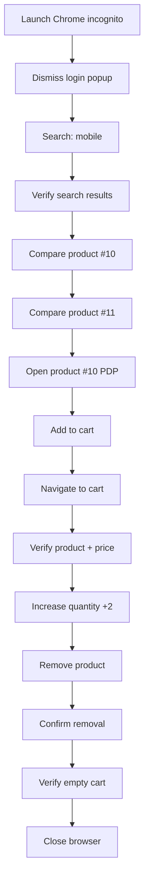

# Flipkart Test Automation — Technical Project Documentation

> **Last updated:** June 2026  
> **Deep dive:** See [TECHNICAL_REFERENCE.md](TECHNICAL_REFERENCE.md) for call stacks,algorithms, and implementation details.


## 1. Executive Summary

This project is a **production-style end-to-end (E2E) UI test automation framework** for [Flipkart](https://www.flipkart.com), India's largest e-commerce platform. It validates a complete shopping journey against the **live production website** — not a mock or staging stub.

### What it tests

| Phase | Screens covered | Key validations |
|-------|-----------------|-----------------|
| Discovery | HomePage | Site loads, login modal dismissed |
| Search | SearchPage | Keyword search, pagination summary, product cards |
| Selection | SearchPage + ProductPage | Product compare tray, PDP load, add-to-cart |
| Checkout prep | CartPage | Product presence, price consistency, qty update, remove, empty cart |

### Framework characteristics

- **Test runner:** Robot Framework 7 (keyword-driven, human-readable)
- **Browser automation:** Selenium 4 + SeleniumLibrary 6.3
- **Language mix:** Robot (`.robot`) for orchestration + Python for complex DOM logic
- **Pattern:** Page Object Model (POM) with a **4-layer separation of concerns**
- **Session model:** Single browser session shared across all 4 test cases (stateful E2E chain)
- **Scope:** 4 test cases, 14 atomic steps, tagged for smoke and regression

---

## 2. Technology Stack & Prerequisites

### Dependencies (`requirements.txt`)

```
robotframework==7.0
robotframework-seleniumlibrary==6.3.0
selenium>=4.15.0
```

### Runtime requirements

| Component | Role |
|-----------|------|
| Python 3.9+ | Hosts Robot Framework and custom libraries |
| Google Chrome | Headed browser (incognito mode) |
| ChromeDriver | Auto-managed by Selenium Manager on first run |
| Internet access | Tests hit `https://www.flipkart.com` live |
| Desktop display | Chrome runs **headed**; Linux servers need `DISPLAY` or headless adaptation |

There is **no database, no `.env` file, and no API backend** in this project. All configuration is via Robot variables and optional environment variables (proxy, user-agent).

---

## 3. Architecture Overview

### High-level system diagram

```
┌─────────────────────────────────────────────────────────────────────┐
│                        EXECUTION LAYER                              │
│  run_flipkart_tests.sh │ run_flipkart_smoke_tests.sh │ regression   │
│         robot CLI → HTML reports (log.html, report.html)            │
└──────────────────────────────┬──────────────────────────────────────┘
                               │
┌──────────────────────────────▼──────────────────────────────────────┐
│                     TEST SUITE LAYER (.robot)                       │
│  FlipkartTestSuite.robot │ FlipkartSmokeTestSuite.robot             │
│  FlipkartRegressionTestSuite.robot                                  │
│  • 4 test cases, tags (smoke/regression/e2e)                        │
│  • Suite teardown: Close All Browsers                               │
│  • Test teardown: Screenshot on failure                             │
└──────────────────────────────┬──────────────────────────────────────┘
                               │
┌──────────────────────────────▼──────────────────────────────────────┐
│                   TEST CASE LAYER (Steps)                           │
│  01HomePageTC.robot          → Steps 1–2                            │
│  02SearchPageTC.robot        → Steps 3–5                            │
│  03SearchPageProductPageCartPageTC.robot → Steps 6–10               │
│  04CartPageTC.robot          → Steps 11–14                          │
└──────────────────────────────┬──────────────────────────────────────┘
                               │
┌──────────────────────────────▼──────────────────────────────────────┐
│                   PAGE OBJECT LAYER (Screen/*.robot)                │
│  HomePage │ SearchPage │ ProductPage │ CartPage                     │
│  • Locators (XPath/CSS)  • High-level page keywords                 │
└──────────────────────────────┬──────────────────────────────────────┘
                               │
┌──────────────────────────────▼──────────────────────────────────────┐
│              INFRASTRUCTURE & ACTION LAYER (Python)                 │
│  BrowserFactory │ ProxyManager │ WaitUtils │ FlipkartActions        │
│  flipkart/ { base, home, search, product, cart, pricing, actions }  │
└──────────────────────────────┬──────────────────────────────────────┘
                               │
┌──────────────────────────────▼──────────────────────────────────────┐
│                    BROWSER + TARGET APPLICATION                     │
│  Chrome (incognito, stealth) → https://www.flipkart.com             │
└─────────────────────────────────────────────────────────────────────┘
```

### Data flow (single test run)

```
Shell script
    → robot CLI (variables: rbt_env=qa, rbt_usr=Default)
        → Test Suite loads TestEnv + TestUser + Screen + TestCase resources
            → Step keyword calls Screen keyword
                → Screen keyword calls Python library method
                    → Selenium WebDriver interacts with Flipkart DOM
                        → Assertion / verification back up the stack
                            → HTML report + optional failure screenshot
```

### Layering contract

```
Test Suite  →  TestCases (steps)  →  Screen (.robot)  →  FlipkartActions (Python)
```

Each layer has a **single responsibility**:

- **Suite:** Orchestration, tags, setup/teardown hooks
- **TestCases:** Business-readable step sequences (Step 1, Step 2, …)
- **Screen:** Page-specific locators and page-level keywords
- **Python:** Complex DOM queries, waits, price parsing, multi-window handling

---

## 4. Project Structure & Layering

```
testautomation/
├── PROJECT_DOCUMENTATION.md     ← This document
├── README.md                    ← Quick start & troubleshooting
├── requirements.txt
├── run_flipkart_tests.sh        ← Full E2E suite
├── run_flipkart_smoke_tests.sh  ← Smoke-tagged run
├── run_flipkart_regression_tests.sh
│
├── Testsuite/                   ← Robot suites + generated HTML reports
│   ├── FlipkartTestSuite.robot
│   ├── FlipkartSmokeTestSuite.robot
│   ├── FlipkartRegressionTestSuite.robot
│   ├── log.html / report.html / output.xml
│
├── Resource/
│   ├── TestEnv/
│   │   ├── RunDefaults.robot        ← Default rbt_env, rbt_usr
│   │   ├── TestEnv_qa.robot         ← URL, search keyword, indexes, waits
│   │   └── TestEnv_dev.robot        ← Dev overrides
│   │
│   ├── TestUser/
│   │   └── TestUser_Default.robot   ← User profile variables
│   │
│   ├── TestCases/Flipkart/          ← Step-level keywords (14 steps)
│   │   ├── 01HomePageTC.robot
│   │   ├── 02SearchPageTC.robot
│   │   ├── 03SearchPageProductPageCartPageTC.robot
│   │   └── 04CartPageTC.robot
│   │
│   ├── Screen/                      ← Page Object Model
│   │   ├── HomePage.robot
│   │   ├── SearchPage.robot
│   │   ├── ProductPage.robot
│   │   └── CartPage.robot
│   │
│   ├── Keywords/
│   │   ├── Common.robot             ← Browser open, waits, screenshots
│   │   └── FlipkartFlow.robot       ← Shared flow helpers
│   │
│   └── Libraries/
│       ├── FlipkartActions.py       ← Robot entry point (re-exports)
│       ├── BrowserFactory.py        ← Chrome + stealth + proxy
│       ├── ProxyManager.py          ← Optional proxy pool
│       ├── WaitUtils.py             ← Explicit wait keywords
│       ├── DataReader.py            ← Data utilities
│       └── flipkart/                ← Mixin-based screen logic
│           ├── __init__.py
│           ├── actions.py           ← Combines all mixins
│           ├── base.py              ← Shared helpers, window mgmt
│           ├── home.py              ← Login popup dismissal
│           ├── search.py            ← Cards, compare, open product
│           ├── product.py           ← Add to cart, navigate to cart
│           ├── cart.py              ← Qty, remove, empty cart
│           └── pricing.py           ← Price extraction & comparison
│
└── Output/Screenshots/              ← failure_*.png on test failure
```

---

## 5. Core Python Libraries

### 5.1 BrowserFactory — Browser bootstrap

**File:** `Resource/Libraries/BrowserFactory.py`

Responsible for creating a hardened Chrome instance and registering it with SeleniumLibrary.

| Feature | Implementation |
|---------|----------------|
| Incognito mode | `--incognito` flag |
| Anti-bot stealth | `--disable-blink-features=AutomationControlled`, `navigator.webdriver` override via CDP |
| Window sizing | `--start-maximized` + `driver.maximize_window()` |
| User-agent | Configurable via `BROWSER_USER_AGENT` env var |
| Proxy | Integrated with `ProxyManager` |
| Driver registration | Custom driver injected into SeleniumLibrary via `register_driver()` |

**Key Robot keywords:** `Open Chrome With Proxy`, `Create Chrome Driver`, `Get Chrome Options`

### 5.2 ProxyManager — Optional network routing

**File:** `Resource/Libraries/ProxyManager.py`

Proxy is **disabled by default**. Enable via environment variables:

```bash
export PROXY_HOST=proxy.example.com
export PROXY_PORT=8080
# OR rotating pool:
export PROXY_POOL="host1:8080,user:pass@host2:8080"
```

Supports authenticated proxies via a dynamically generated Chrome extension (ZIP).

### 5.3 WaitUtils — Explicit synchronization

**File:** `Resource/Libraries/WaitUtils.py`

Wraps Selenium `WebDriverWait` with Robot keywords:

- `Wait For Element Visible / Clickable / Present`
- `Wait For Page To Contain`
- `Safe Click Element` — 3 retry attempts + JavaScript click fallback
- `Safe Input Text` — scroll-into-view + clear + type

Implicit wait is set to **0 seconds** in `Common.robot`; all waits are explicit.

### 5.4 FlipkartActions — Screen-wise Python mixins

**Entry point:** `Resource/Libraries/FlipkartActions.py` → `flipkart/actions.py`

Uses **multiple inheritance (mixin pattern)** to compose screen-specific behavior:

```python
class FlipkartActions(
    FlipkartBase,           # Shared: driver access, timeouts, window switching
    FlipkartHomeActions,    # Login popup dismissal
    FlipkartSearchActions,  # Product cards, compare tray, open PDP
    FlipkartPricingActions, # Price parsing, cart total validation
    FlipkartProductActions, # Add to cart, go-to-cart navigation
    FlipkartCartActions,    # Quantity, remove, empty cart
):
    ROBOT_LIBRARY_SCOPE = "GLOBAL"
```

#### Why Python for Flipkart logic?

Flipkart's UI uses **dynamic CSS class names** (e.g., `css-g5y9jx`, `8MOCJ3`) and **SVG icon-based CTAs** instead of stable text buttons. Pure XPath locators break frequently. The Python layer uses:

- **JavaScript DOM queries** (`execute_script`) for resilient element discovery
- **Heuristic scoring** (visibility, bounding box, text patterns, aria-labels)
- **Multi-strategy fallbacks** (text CTA → icon CTA → XPath → direct URL navigation)
- **Session state** (`_selected_listing_price`, `_compared_products`) across steps

#### Module responsibilities

| Module | Key capabilities |
|--------|------------------|
| `base.py` | Driver via SeleniumLibrary, timeout parsing, cart/PDP window switching, scroll helpers |
| `home.py` | Dismiss login modal (`span[role='button']` close icon) |
| `search.py` | Collect product cards by `div[data-id]`, compare checkbox activation, compare tray validation, open product in new tab |
| `product.py` | Find Add to Cart (text or SVG icon), verify "Going to cart" state, navigate to cart via snackbar/header/PDP/direct URL |
| `cart.py` | Quantity dropdown, `+` button fallback, remove confirmation popup, empty cart ("Missing Cart items?") |
| `pricing.py` | Extract selling price (exclude EMI/fees), normalize `₹` values, compare listing vs cart total |

---

## 6. End-to-End Test Flow

### Session model

All 4 test cases run in **one browser session**. The browser opens in Test Case 01 and closes in Suite Teardown. State (cart contents, product name, listing price) flows via **suite variables** (`${PRODUCT_NAME}`, `${LISTING_PRICE}`).

### Test Case 01 — HomePage *(Steps 1–2)*

| Step | Action | Technical detail |
|------|--------|----------------|
| 1 | Open Flipkart | `BrowserFactory.open_chrome_with_proxy()` → navigate to `${URL}` |
| 2 | Close login popup | XPath modal detection + close button click; Python fallback `dismiss_login_popup_if_visible()` |

### Test Case 02 — SearchPage *(Steps 3–5)*

| Step | Action | Technical detail |
|------|--------|----------------|
| 3 | Click search box | Focus `input[name='q']` |
| 4 | Search "mobile" | `${SEARCH_KEYWORD}` from TestEnv → Enter key → wait for `div[data-id]` cards |
| 5 | Verify results | Assert body contains "Showing 1 – 24 of" + keyword; load ≥11 product cards |

### Test Case 03 — Search + Product + Cart *(Steps 6–10)*

| Step | Action | Technical detail |
|------|--------|----------------|
| 6 | Compare products 10 & 11 | Toggle compare checkboxes; verify floating COMPARE tray count = 1, then 2 |
| 7 | Open 10th product | Capture listing price; open PDP (new tab handling); verify title |
| 8 | Add to cart | Click Add to Cart (icon or text); verify CTA changes to "Going to cart" |
| 9 | Verify in cart | Navigate via snackbar/header/PDP; assert product name in cart body |
| 10 | Verify price | Compare stored listing price vs cart "Total Amount" (normalized digits) |

### Test Case 04 — CartPage *(Steps 11–14)*

| Step | Action | Technical detail |
|------|--------|----------------|
| 11 | Increase quantity | Set qty to current + `${QTY_INCREASE_BY}` (default 2); verify toast or qty selector |
| 12 | Remove product | Click Remove; verify confirmation popup (Cancel + Remove) |
| 13 | Confirm removal | Click Remove on popup; verify "removed from your cart" message |
| 14 | Verify empty cart | Assert "Missing Cart items?" — **final pass criterion** |

### Flow diagram



---

## 7. Execution, Reporting & CI Considerations

### Run commands

```bash
# Full E2E (4 tests)
./run_flipkart_tests.sh

# Smoke only (Force Tags smoke)
./run_flipkart_smoke_tests.sh

# Regression only
./run_flipkart_regression_tests.sh

# Manual with custom env
robot --outputdir Testsuite \
  --variable rbt_env:qa \
  --variable rbt_usr:Default \
  Testsuite/FlipkartTestSuite.robot
```

### Reports

| Artifact | Location | Purpose |
|----------|----------|---------|
| `log.html` | `Testsuite/` | Step-by-step execution log |
| `report.html` | `Testsuite/` | Pass/fail summary |
| `output.xml` | `Testsuite/` | Machine-readable (CI integration) |
| `failure_*.png` | `Output/Screenshots/` | Captured on test failure |

### Tag strategy

| Tag | Usage |
|-----|-------|
| `smoke` | Quick validation — all 4 tests in smoke suite |
| `regression` | Full regression suite |
| `e2e` | End-to-end marker on all tests |
| `homepage`, `searchpage`, `productpage`, `cartpage` | Screen-level filtering |

### CI notes

- Requires Chrome + display (or headless adaptation)
- Tests are **flaky-sensitive** to Flipkart UI changes and bot detection
- Product index `${CART_PRODUCT_INDEX}` (default 10) may need tuning if search results shift
- No parallel execution — sequential stateful session

---

## 8. Configuration & Extensibility

### Environment variables (TestEnv)

**File:** `Resource/TestEnv/TestEnv_qa.robot`

| Variable | Default | Purpose |
|----------|---------|---------|
| `${URL}` | `https://www.flipkart.com` | Base URL |
| `${SEARCH_KEYWORD}` | `mobile` | Search term |
| `${COMPARE_PRODUCT_INDEX_1}` | `10` | First compare product |
| `${COMPARE_PRODUCT_INDEX_2}` | `11` | Second compare product |
| `${CART_PRODUCT_INDEX}` | `10` | Product added to cart |
| `${QTY_INCREASE_BY}` | `2` | Quantity increment |
| `${EXPLICIT_WAIT}` | `20s` | Default timeout |

Switch environment:

```bash
robot --variable rbt_env:dev --variable rbt_usr:Default Testsuite/FlipkartTestSuite.robot
```

### How to extend

| Goal | Where to change |
|------|-----------------|
| Add a new page | Create `Resource/Screen/NewPage.robot` + `flipkart/newpage.py` mixin |
| Add test steps | Create/update `Resource/TestCases/Flipkart/XXNewTC.robot` |
| Add test case | Add to `Testsuite/FlipkartTestSuite.robot` |
| Change search/product index | Edit `TestEnv_qa.robot` |
| Add new browser | Extend `BrowserFactory.py` |
| Support headless CI | Add `--headless=new` in `BrowserFactory.get_chrome_options()` |

---

## 9. Design Decisions & Resilience Patterns

### Why Robot Framework + Python hybrid?

- **Robot:** Readable test cases for QA and stakeholders; built-in reporting; tag-based suite selection
- **Python:** Complex DOM logic, regex price parsing, JavaScript execution — impractical in pure Robot

### Resilience techniques used

1. **Multi-strategy element location** — XPath → CSS → JavaScript query → URL fallback
2. **Retry loops** — Safe click (3 attempts), quantity increase (3 attempts), card loading (12 scroll iterations)
3. **Window/tab management** — Auto-switch to PDP tab (`/p/`) and cart tab (`viewcart`)
4. **Heuristic product card filtering** — Requires `₹` price + `/p/` link + name length ≥ 8; excludes "Trending", "Sponsored"
5. **Price normalization** — Strip non-digits before comparison; exclude EMI/monthly prices
6. **Stealth browsing** — Incognito, automation flag removal, custom user-agent
7. **Failure artifacts** — Screenshot on every test failure via `Take Screenshot On Failure` teardown

### Known limitations

- **Live site dependency** — No test doubles; network and UI changes affect stability
- **Index-based product selection** — Assumes ≥11 search results; breaks if layout changes
- **Headed-only default** — Not configured for headless CI out of the box
- **No login flow** — Tests run as anonymous/guest user; login popup is dismissed, not authenticated
- **Dynamic CSS classes** — Flipkart obfuscated class names require maintenance when UI refactors

## Quick Reference

```bash
# Setup
python3 -m venv .venv && source .venv/bin/activate
pip install -r requirements.txt

# Run
./run_flipkart_tests.sh

# View report
open Testsuite/report.html   # macOS
xdg-open Testsuite/report.html   # Linux
```

---

*This document describes the `testautomation` project as of June 2026. For setup troubleshooting, see [README.md](README.md).*
